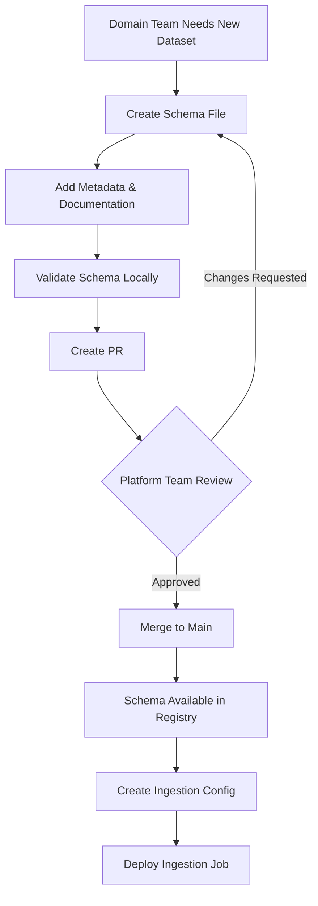
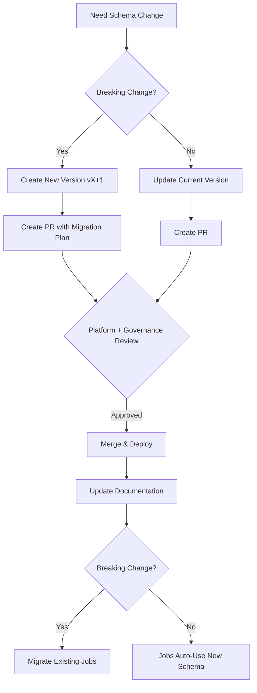

## Schema Registry Governance & Enforcement

This document explains how schemas are managed, enforced, and governed in the lakehouse-ingestion platform.

---

## Table of Contents

1. [Current Enforcement Mechanisms](#current-enforcement-mechanisms)
2. [Enforcement Gaps & Solutions](#enforcement-gaps--solutions)
3. [Who Manages Schemas](#who-manages-schemas)
4. [Schema Lifecycle](#schema-lifecycle)
5. [Governance Workflow](#governance-workflow)
6. [Best Practices](#best-practices)

---

## Current Enforcement Mechanisms

### How Schema Registry is Used Today

**In IngestionJob** (src/main/scala/com/lakehouse/ingestion/core/IngestionJob.scala:32-44):

```scala
// 1. Schema is ALWAYS fetched from registry
val schema = schemaRegistry.getSchema(
  domain = config.schema.domain,
  dataset = config.schema.dataset,
  version = config.schema.version
)

// 2. Schema is passed to reader
val df = reader.read(
  spark = spark,
  options = config.source.options,
  schema = Some(schema)  // ✅ Passed to reader
)
```

**In KafkaReader** (src/main/scala/com/lakehouse/ingestion/io/KafkaReader.scala:47-53):

```scala
schema match {
  case Some(s) if s.nonEmpty =>
    // ✅ If schema provided, parse JSON with it
    valueDf.select(from_json(col("value"), s).alias("data")).select("data.*")
  case _ =>
    // ⚠️ Fallback: return raw value
    valueDf
}
```

### Enforcement Points

| Stage | Current Behavior | Enforcement Level |
|-------|------------------|-------------------|
| **Config Load** | Schema reference is required in YAML | ✅ Required |
| **Schema Fetch** | Always fetches from registry | ✅ Enforced |
| **Read** | Schema passed to reader as `Option[StructType]` | ⚠️ Optional |
| **Validation** | No validation that data matches schema | ❌ Missing |
| **Write** | No schema check before write | ❌ Missing |

---

## Enforcement Gaps & Solutions

### Gap 1: Schema is Optional in Readers

**Problem**: Readers receive schema as `Option[StructType]`, allowing them to ignore it.

**Current Risk**:
```scala
// Reader could do this:
def read(spark: SparkSession, options: Map[String, String],
         schema: Option[StructType]): DataFrame = {
  spark.read.json(path)  // ❌ Ignores schema entirely!
}
```

**Solution**: Make schema mandatory + add enforcement layer

```scala
// Updated BaseReader interface (PROPOSED)
trait BaseReader {
  /**
   * Read data with MANDATORY schema application.
   * Readers MUST apply the schema or throw an exception.
   */
  def read(
    spark: SparkSession,
    options: Map[String, String],
    schema: StructType  // ✅ No longer Option - REQUIRED
  ): DataFrame

  /**
   * Whether this reader supports schema enforcement.
   * Default: true (all readers must support schemas)
   */
  def supportsSchemaEnforcement: Boolean = true
}
```

**Implementation**:
```scala
// In IngestionJob.scala
val schema = schemaRegistry.getSchema(...)  // Returns StructType (not Option)

// Validate reader supports schema enforcement
if (!reader.supportsSchemaEnforcement) {
  throw new IllegalStateException(
    s"Reader ${reader.getClass.getName} does not support schema enforcement. " +
    "All readers must enforce schemas."
  )
}

val df = reader.read(spark, config.source.options, schema)
```

---

### Gap 2: No Data Validation After Read

**Problem**: Data is read but never validated against the expected schema.

**Current Risk**:
- Source data may have extra columns
- Source data may be missing required columns
- Data types may not match
- Nullability constraints may be violated

**Solution**: Add schema validation layer

```scala
// New utility: SchemaValidator.scala
object SchemaValidator {

  /**
   * Validates that DataFrame matches expected schema.
   * Throws exception if validation fails.
   */
  def validateOrThrow(df: DataFrame, expected: StructType): Unit = {
    val actual = df.schema

    // Check 1: All expected columns present
    val missingCols = expected.fields.map(_.name).diff(actual.fields.map(_.name))
    if (missingCols.nonEmpty) {
      throw new SchemaValidationException(
        s"Missing required columns: ${missingCols.mkString(", ")}"
      )
    }

    // Check 2: Data types match
    expected.fields.foreach { expectedField =>
      actual.fields.find(_.name == expectedField.name) match {
        case Some(actualField) =>
          if (actualField.dataType != expectedField.dataType) {
            throw new SchemaValidationException(
              s"Type mismatch for column '${expectedField.name}': " +
              s"expected ${expectedField.dataType}, got ${actualField.dataType}"
            )
          }
        case None =>
          // Already checked in step 1
      }
    }

    // Check 3: Nullability constraints
    expected.fields.foreach { expectedField =>
      if (!expectedField.nullable) {
        val nullCount = df.filter(col(expectedField.name).isNull).count()
        if (nullCount > 0) {
          throw new SchemaValidationException(
            s"Column '${expectedField.name}' has $nullCount null values but is marked NOT NULL"
          )
        }
      }
    }
  }

  /**
   * Validates and returns validation result (non-throwing).
   */
  def validate(df: DataFrame, expected: StructType): SchemaValidationResult = {
    try {
      validateOrThrow(df, expected)
      SchemaValidationResult.success()
    } catch {
      case e: SchemaValidationException =>
        SchemaValidationResult.failure(e.getMessage)
    }
  }
}
```

**Usage in IngestionJob**:
```scala
// After reading data
val df = reader.read(spark, config.source.options, schema)

// ✅ Validate schema
SchemaValidator.validateOrThrow(df, schema)

// Continue with DQ checks...
```

---

### Gap 3: No Config-Time Validation

**Problem**: Config can reference non-existent schemas, failing at runtime.

**Solution**: Add config validation on load

```scala
// In ConfigLoader.scala
object ConfigLoader {

  def loadFromFile(path: String): PipelineConfig = {
    val config = loadRawConfig(path)  // Load YAML

    // ✅ Validate all configs
    validatePipelineConfig(config)

    config
  }

  private def validatePipelineConfig(config: PipelineConfig): Unit = {
    // Initialize schema registry
    val schemaRegistry = new FileBasedSchemaRegistry("schemas")

    config.jobs.foreach { job =>
      // Validate schema exists
      try {
        schemaRegistry.getSchema(
          job.schema.domain,
          job.schema.dataset,
          job.schema.version
        )
      } catch {
        case e: Exception =>
          throw new ConfigValidationException(
            s"Invalid schema reference in job ${job.domain}.${job.dataset}: " +
            s"Schema '${job.schema.domain}/${job.schema.dataset}/${job.schema.version.getOrElse("latest")}' not found. " +
            s"Please add schema file before running this job.",
            cause = e
          )
      }

      // Validate other required fields...
    }
  }
}
```

---

### Gap 4: No Write-Time Schema Check

**Problem**: Writers don't verify schema before writing to lakehouse.

**Solution**: Add pre-write validation in LakehouseWriter

```scala
// In LakehouseWriter implementations
class IcebergAppendWriter(spark: SparkSession) extends BaseWriter {

  override def write(df: DataFrame, options: Map[String, String]): Unit = {
    val tableName = options("table")

    // ✅ Check if table exists
    if (tableExists(tableName)) {
      // ✅ Validate schema matches existing table
      val existingSchema = getTableSchema(tableName)
      validateSchemaCompatibility(df.schema, existingSchema)
    }

    // Proceed with write
    df.write.format("iceberg").mode("append").save(tableName)
  }

  private def validateSchemaCompatibility(
    newSchema: StructType,
    existingSchema: StructType
  ): Unit = {
    // Check schema evolution rules
    // - New columns OK if nullable
    // - Removing columns NOT OK
    // - Type changes NOT OK
    // etc.
  }
}
```

---

## Who Manages Schemas

### Roles and Responsibilities

```
┌─────────────────────────────────────────────────────────────┐
│                    Schema Governance Model                   │
└─────────────────────────────────────────────────────────────┘

1. Data Producers (Domain Teams)
   ├─ Create initial schemas for their datasets
   ├─ Propose schema changes
   └─ Document business meaning of fields

2. Platform Team (Data Engineering)
   ├─ Review and approve schema changes
   ├─ Ensure schema consistency across domains
   ├─ Manage schema registry infrastructure
   └─ Define schema standards and guidelines

3. Data Governance Team (Optional)
   ├─ Define PII/sensitive data policies
   ├─ Approve schemas with sensitive data
   └─ Audit schema compliance

4. Automated Systems
   ├─ Schema evolution detection (from sources)
   ├─ Compatibility validation (CI/CD)
   └─ Schema documentation generation
```

### Ownership Matrix

| Schema Type | Owner | Approver | Example |
|-------------|-------|----------|---------|
| **Domain Schemas** | Domain Team | Platform Team | payments.transactions, users.events |
| **Shared Schemas** | Platform Team | Data Governance | common.audit_columns, common.metadata |
| **System Schemas** | Platform Team | Platform Team | _internal.checkpoints, _dq.quarantine |

---

## Schema Lifecycle

### 1. Schema Creation

**Process**:

```bash
# Step 1: Data engineer creates schema file
mkdir -p schemas/payments/transactions
cat > schemas/payments/transactions/v1.json <<EOF
{
  "type": "struct",
  "fields": [
    {
      "name": "transaction_id",
      "type": "string",
      "nullable": false,
      "metadata": {
        "description": "Unique transaction identifier",
        "pii": false
      }
    },
    {
      "name": "amount",
      "type": "decimal(10,2)",
      "nullable": false,
      "metadata": {
        "description": "Transaction amount in USD",
        "pii": false
      }
    }
  ]
}
EOF

# Step 2: Validate schema format
./scripts/validate-schema.sh schemas/payments/transactions/v1.json

# Step 3: Create Git commit
git add schemas/payments/transactions/v1.json
git commit -m "[schema] Add payments.transactions v1 schema"

# Step 4: Create PR for review
gh pr create --title "[Schema] Add payments.transactions v1" \
  --body "Initial schema for payments transactions ingestion"

# Step 5: Platform team reviews and merges
# Schema is now available in registry
```

### 2. Schema Evolution

**Versioning Strategy**:
- **v1, v2, v3**: Major versions (breaking changes)
- Within version: Only backward-compatible changes allowed

**Allowed Changes** (within version):
- ✅ Add new nullable columns
- ✅ Relax NOT NULL → nullable
- ✅ Widen numeric types (int → long, float → double)
- ✅ Add metadata/documentation

**Breaking Changes** (require new version):
- ❌ Remove columns
- ❌ Rename columns
- ❌ Change data types (incompatible)
- ❌ Make nullable → NOT NULL

**Example Evolution**:

```bash
# Create v2 schema (breaking change)
cp schemas/payments/transactions/v1.json \
   schemas/payments/transactions/v2.json

# Edit v2.json to add new required field
# This is a breaking change → new version

# Both v1 and v2 exist
# Old jobs continue using v1
# New jobs use v2
```

### 3. Schema Deprecation

**Process**:
1. Add deprecation notice to schema metadata
2. Identify all jobs using deprecated schema
3. Migrate jobs to new schema version
4. After grace period (e.g., 90 days), archive old schema

**Example**:
```json
{
  "type": "struct",
  "metadata": {
    "deprecated": true,
    "deprecation_date": "2024-12-01",
    "replacement": "v2",
    "migration_guide": "https://wiki/schemas/payments-transactions-v1-to-v2"
  },
  "fields": [...]
}
```

---

## Governance Workflow

### Schema Addition (New Dataset)



### Schema Change (Evolution)



### Review Checklist

Platform team reviews schema PRs using this checklist:

**Schema Quality**:
- [ ] All fields have descriptions in metadata
- [ ] PII fields marked appropriately
- [ ] Nullability is correct (conservative: prefer nullable)
- [ ] Data types are appropriate (no over-wide types)
- [ ] Naming follows conventions (snake_case)

**Compatibility**:
- [ ] If existing schema: changes are backward compatible OR new version created
- [ ] No duplicate field names
- [ ] No reserved keywords used

**Documentation**:
- [ ] Business meaning documented
- [ ] Source system documented
- [ ] Example values provided for enums/categories

**Governance**:
- [ ] PII/sensitive data approved by governance team (if applicable)
- [ ] Retention policy documented
- [ ] Data classification level assigned

---

## Best Practices

### 1. Schema Design Principles

**Conservative Nullability**:
```json
// ❌ BAD: Making fields NOT NULL too early
{
  "name": "customer_email",
  "type": "string",
  "nullable": false  // What if source doesn't always provide email?
}

// ✅ GOOD: Start nullable, tighten later
{
  "name": "customer_email",
  "type": "string",
  "nullable": true,  // Can add NOT NULL constraint later if validated
  "metadata": {
    "expected_non_null_rate": 0.95
  }
}
```

**Rich Metadata**:
```json
{
  "name": "transaction_status",
  "type": "string",
  "nullable": false,
  "metadata": {
    "description": "Current status of the transaction",
    "allowed_values": ["pending", "completed", "failed", "cancelled"],
    "pii": false,
    "source_column": "txn_status",
    "business_owner": "payments-team@company.com"
  }
}
```

**Avoid Over-Wide Types**:
```json
// ❌ BAD: Over-wide type
{
  "name": "item_count",
  "type": "long"  // Range is 1-100, don't need 64-bit
}

// ✅ GOOD: Appropriate type
{
  "name": "item_count",
  "type": "integer",  // int32 is sufficient
  "metadata": {
    "min_value": 1,
    "max_value": 100
  }
}
```

### 2. Naming Conventions

| Element | Convention | Example |
|---------|-----------|---------|
| Domain | lowercase, underscore | `payments`, `user_events` |
| Dataset | lowercase, underscore | `transactions`, `click_stream` |
| Columns | lowercase, underscore | `customer_id`, `created_at` |
| Version | `v` + number | `v1`, `v2`, `v10` |

### 3. Common Schemas

Create shared schemas for common patterns:

**Audit Columns** (`schemas/common/audit_columns/v1.json`):
```json
{
  "type": "struct",
  "fields": [
    {"name": "_ingestion_time", "type": "timestamp", "nullable": false},
    {"name": "_source_system", "type": "string", "nullable": false},
    {"name": "_source_file", "type": "string", "nullable": true},
    {"name": "_job_id", "type": "string", "nullable": false}
  ]
}
```

**Use in dataset schemas**:
```json
{
  "type": "struct",
  "fields": [
    {"name": "transaction_id", "type": "string", "nullable": false},
    {"name": "amount", "type": "decimal(10,2)", "nullable": false},
    // Reference common audit schema
    {"$ref": "common/audit_columns/v1.json"}
  ]
}
```

### 4. Schema Documentation

Each schema should have accompanying documentation:

**File**: `schemas/payments/transactions/README.md`
```markdown
# Payments Transactions Schema

## Overview
Contains all payment transactions from the payments service.

## Source System
- System: Payments API
- Format: JSON via Kafka topic `payments.transactions`
- Frequency: Real-time stream
- Volume: ~10K events/minute

## Schema Versions

### v2 (Current)
- Added: `payment_method` field
- Added: `merchant_category_code`
- Migration from v1: [Link to guide]

### v1 (Deprecated 2024-12-01)
- Initial schema

## Business Context
- Owner: Payments Team
- Contact: payments@company.com
- Retention: 7 years (regulatory requirement)
- PII: Contains customer identifiers
```

---

## Enforcement Roadmap

### Phase 1 (Current - Partial Enforcement)
- [x] Schema reference required in config
- [x] Schema fetched from registry
- [x] Schema passed to readers
- [ ] Schema validation after read
- [ ] Config-time schema existence check

### Phase 2 (Full Enforcement)
- [ ] Make schema mandatory (not Optional)
- [ ] Add SchemaValidator utility
- [ ] Enforce validation in IngestionJob
- [ ] Add write-time schema compatibility checks
- [ ] Add schema evolution validation

### Phase 3 (Advanced Governance)
- [ ] Automated schema discovery from sources
- [ ] Schema drift detection
- [ ] Schema lineage tracking
- [ ] Schema documentation auto-generation
- [ ] Schema registry UI

---

## FAQ

**Q: Can I skip the schema registry for one-off jobs?**
A: No. All ingestion jobs MUST use schema registry. This ensures consistency and prevents schema drift. For one-off jobs, create a schema in the registry first.

**Q: What if source schema changes unexpectedly?**
A: The schema validation will catch this and fail the job. Investigate the source change, update the schema registry with a new version, and update the job config.

**Q: How do I handle schemas with 100+ columns?**
A: Use schema generation tools or extract schema from source system. Store in registry as normal. Consider if all columns are needed (select only required columns).

**Q: Can I use schema inference for exploratory work?**
A: For local development/exploration, yes. But never in production. Once you understand the data, codify the schema in the registry.

**Q: Who reviews schema PRs?**
A: Platform team (mandatory). Data governance team (if PII/sensitive data present).

---

## Tools & Automation

### Planned Tools

**Schema Validator CLI**:
```bash
# Validate schema file format
./scripts/validate-schema.sh schemas/payments/transactions/v1.json

# Check schema compatibility
./scripts/check-schema-compat.sh \
  --old schemas/payments/transactions/v1.json \
  --new schemas/payments/transactions/v2.json
```

**Schema Generator**:
```bash
# Generate schema from Kafka topic (Avro)
./scripts/generate-schema.sh \
  --type kafka-avro \
  --topic payments.transactions \
  --output schemas/payments/transactions/v1.json

# Generate schema from sample JSON file
./scripts/generate-schema.sh \
  --type json \
  --sample data/sample.json \
  --output schemas/my_dataset/v1.json
```

---

## Summary

**Enforcement Mechanism**:
1. ✅ Config requires schema reference
2. ✅ Schema fetched from registry
3. ⚠️ Schema passed to readers (but optional)
4. ❌ No validation after read (NEED TO ADD)
5. ❌ No write-time validation (NEED TO ADD)

**Schema Management**:
1. Domain teams create schemas
2. Platform team reviews & approves
3. Schemas versioned in Git
4. Schema evolution via new versions (breaking) or updates (compatible)
5. Automated validation in CI/CD

**Next Steps**:
1. Complete file-based schema registry implementation
2. Add SchemaValidator utility
3. Make schema mandatory in readers
4. Add config-time validation
5. Implement schema documentation standards
